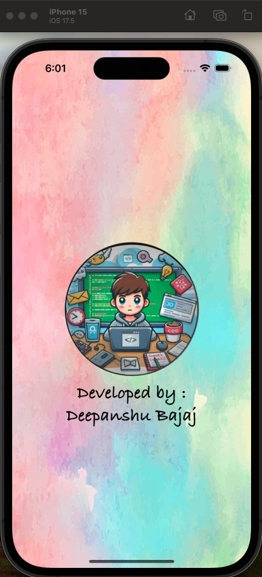
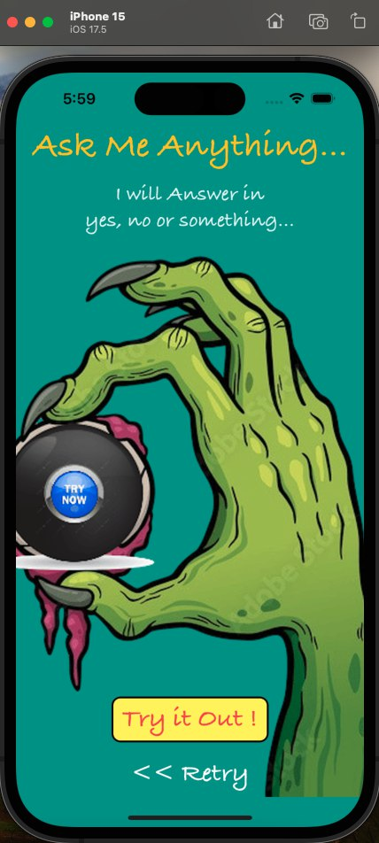
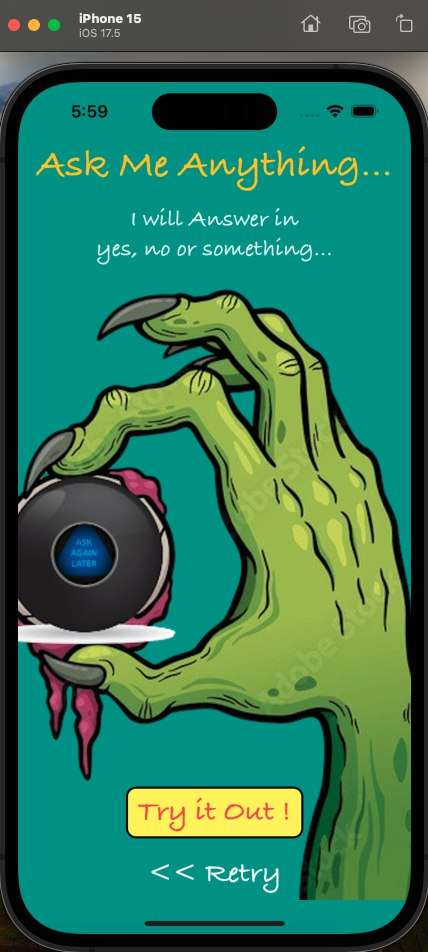
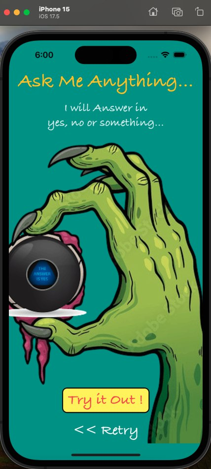

<h1 align="center">Magic 8 Ball - iOS App</h1>

**Magic 8 Ball** is an iOS app that provides answers to all of life's tough questions, just like the classic Magic 8 Ball toy. Tap the button, and the app will give you a random answer to guide you through any decision-making dilemma! Whether it's a yes, no, or maybe, you'll always have an answer when you need it most!

## Features :

- **Ask the Magic 8 Ball**: Tap the "Ask" button to receive an answer to your question.
- **Random Answers**: The app provides randomized responses like "Yes," "No," "Maybe," and more, just like the classic Magic 8 Ball.
- **Interactive UI**: Simple and fun design with a smooth interface that makes asking questions enjoyable.

## Installation :

To run this project locally:

1. Clone the repository:
    ```bash
    git clone https://github.com/deepanshubajaj/Magic-8-Ball-iOSApp.git
    ```

2. Open the project in Xcode:
    ```bash
    open Magic 8 Ball.xcodeproj
    ```

3. Build and run the app on a simulator or physical device.

> Configure the project appropriately.

## App Look :

<p align="center">
  
</p>
<p align="center">
  *App snapshot in the simulator.*
</p>

## Screenshots :

<p align="center">
  
</p>
<p align="center">
  *Splash screen displayed upon app launch.*
</p>

<p align="center">
  <div style="display: flex; justify-content: center; gap: 10px;">
    
    
    
  </div>
</p>

<p align="center">
  <div style="display: flex; justify-content: center; gap: 10px;">
    
    
    
  </div>
</p>

<p align="center">
  *Screenshot of the Magic 8 Ball app showing the main screen.*
</p>

## App Icon :

<p align="center">
  
</p>
<p align="center">
  *The app icon represents the theme of the Magic 8 Ball.*
</p>

## Video Demo :

Here’s a short video showcasing the app's functionality:

<p align="center">
  
</p>

[Watch Working Video](ProjectOutputs/WorkingVideo/workingVideo.mov)
